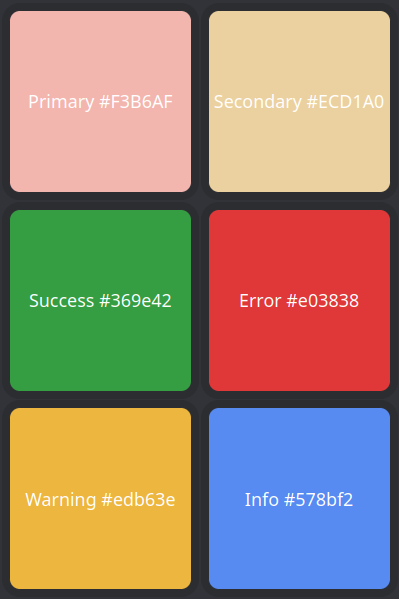

# Another Immersion Bot

## Requirements
1. Node.js (>=16.9.0)
3. Python
4. MongoDB
5. yt-dlp

## Config
To use a configuration file, create a `config.json` in your current directory, or set the environment variable `IB_CONFIG_LOCATION=/some/path/config.json` to the path of your config file.

Some variables can be set with environment variables.

Variables from the config file will precede environment variables. Current config variables are as follows:

<table>
  <tr>
    <th>Name</th>
    <th>Description</th>
    <th>Default</th>
    <th>Type</th>
  </tr>
  <tr>
    <td>token (IB_TOKEN)</td>
    <td>Discord bot token</td>
    <td></td>
    <td>string</td>
  </tr>
  <tr>
    <td>mongoUrl (IB_MONGO_URL)</td>
    <td>The URI used to connect to the database</td>
    <td>mongodb://localhost:27017</td>
    <td>string</td>
  </tr>
  <tr>
    <td>useSqlite</td>
    <td>Use SQLite instead of MongoDB</td>
    <td>False</td>
    <td>boolean</td>
  </tr>
  <tr>
    <td>dbPath</td>
    <td>Path to the database that you want to use with SQLite</td>
    <td>bot_data.db</td>
    <td>string</td>
  </tr>
  <tr>
    <td>chartServiceUrl (IB_CHART_SERVICE_URL)</td>
    <td>URL of http server that generates chart PNG files</td>
    <td>http://localhost:5301/bar</td>
    <td>string</td>
  </tr>
  <tr>
    <td>materialsPath (IB_MATERIALS_PATH)</td>
    <td>Path to folder containing autocomplete titles (see <a href="#materialsPath">materialsPath</a>)</td>
    <td><a href="/data">Provided data folder</a></td>
    <td>string</td>
  </tr>
  <tr>
    <td>logLevel (IB_LOG_LEVEL)</td>
    <td>Level to set the logging service</td>
    <td>info</td>
    <td>string<a href="#logLevel">*</a></td>
  </tr>
  <tr>
    <td>localesPath (IB_LOCALES_PATH)</td>
    <td>Path to folder containing locales files</td>
    <td><a href="/locales">Provided locales folder</a></td>
    <td>string</td>
  </tr>
  <tr>
    <td>colors</td>
    <td>Colors used by the bot (such as for generates images and embeds)</td>
    <td></td>
    <td><a href="#colors">Colors</a></td>
  </tr>
  <tr>
    <td>useFuseAutocompletion</td>
    <td>Whether to use Fuse.js for autocompletion or not</td>
    <td>false</td>
    <td>boolean</td>
  </tr>
  <tr>
    <td>fuseWorkerCount</td>
    <td>Number of workers to use for Fuse.js (duplicate indexes are created for each worker)</td>
    <td>2</td>
    <td>number</td>
  </tr>
  <tr>
    <td>useFlexsearchAutocompletion</td>
    <td>Whether to use Flexsearch for autocompletion or not</td>
    <td>false</td>
    <td>boolean</td>
  </tr>
  <tr>
    <td>maxYtdlProcesses</td>
    <td>Maximum number of yt-dlp processes to run at once</td>
    <td>Variable (based on processor count)</td>
    <td>number</td>
  </tr>
  <tr>
    <td>processAcquisitionTimeout</td>
    <td>How long to wait for a process to acquire a lock before timing out (in milliseconds)</td>
    <td>60000</td>
    <td>number</td>
  </tr>
  <tr>
    <td>speedCacheTtl</td>
    <td>How long to cache speed data for (in milliseconds)</td>
    <td>21600000</td>
    <td>number</td>
  </tr>
  <tr>
    <td>speedCacheClearEvery</td>
    <td>Reset the speed cache entry for a user whenever they log this many new speeds</td>
    <td>5</td>
    <td>number</td>
  </tr>
  <tr>
    <td>speedLookbackDays</td>
    <td>How many days to look back when calculating average speed</td>
    <td>21</td>
    <td>number</td>
  </tr>
  <tr>
    <td>speedLowestWeight</td>
    <td>Lowest possible weight for a speed (if the speed was logged `speedLookbackDays` days ago)</td>
    <td>0.9</td>
    <td>number (0-1)</td>
  </tr>
  <tr>
    <td>useQuickChart</td>
    <td>Use QuickChart API to generate graphs instead of the py-server</td>
    <td>false</td>
    <td>boolean</td>
  </tr>
  <tr>
    <td>quickChartUrl</td>
    <td>URL to QuickChart API</td>
    <td>https://quickchart.io/</td>
    <td>string</td>
  </tr>
</table>

#### logLevel
The log level can be set to one of the following: `debug`, `info`, `warn`, `error`.

#### materialsPath
Files in this directory should be in the format LANG.TYPE.optional-stuff and should be a list of autocomplete entries seperated by a new-line character.
View the /data folder as an example.

#### colors
Colors should be in format `#RRGGBB`. The keys are the names of the colors and the values are the colors themselves.
```ts
{
  primary: `#${string}`;
  secondary: `#${string}`;
  error: `#${string}`;
  warning: `#${string}`;
  info: `#${string}`;
  success: `#${string}`;
}
```

#### Autocompletion configuration recommendations
There are currently three ways to generate autocomplete results (Fuse.js, Flexsearch, and SQLite/MongoDB query), which one you use depends on whether you value speed, scoring quality, or simplicity. 
Here is a simple breakdown. 

Method | Speed | Search Flexibility | Primary Benifit | Demerits | Supports JA titles | Support title grouping*
-------|-------|--------------------|-----------------|----------|--------------------| ------------------------
Fuse.js | Slow (200-300ms) | Flexible | Fuzzy search | Uses worker threads to prevent blocking of event loop, high memory usage | Yes | Yes
Flexsearch | Fast (1-10ms) | Less Flexible | Very fast | No fuzzy search | Yes | Yes
Database (MongoDB) | Variable (network latency) | Very Flexible | Uses MongoDB's language analyzer | No free JA language analyzer, requires querying database over network | No | No
Database (SQLite)  | Fast (1-10ms) | Least Flexible | Very fast and simple | Only matches results against substrings | Yes | No

##### Title grouping
Title grouping allows title entries to also have aliases. For example, with grouping "bozaro" and "oregairu" will become "ぼっち・ざ・ろっく！" and "やはり俺の青春ラブコメはまちがっている." in the suggestions.
Without grouping, aliases will become their own title entries.

## Running

### From Source
1. Either set up your configuration to use sqlite or install [MongoDB community edition](https://www.mongodb.com/docs/manual/installation/) or use a cloud service like [MongoDB Atlas](https://www.mongodb.com/cloud/atlas).
2. Install yt-dlp on the system you will be running the bot on. [See here for installation instructions](https://github.com/yt-dlp/yt-dlp/wiki/Installation).
3. Install [Node.js](https://nodejs.org/en/download) (>=16.9.0) and [Python 3](https://www.python.org/downloads/).
4. Clone the repository. `git clone https://github.com/UTD-JLA/another-immersion-bot.git`
5. Install NPM dependencies. `npm install`
6. Install Python dependencies with `pip install -r py-server/requirements.txt` (use a virtual environment if you want).
7. Build the project. Use either `npm run build` or `npx tsc` to build the project. Use `npx tsc --watch` to watch for changes and rebuild automatically.
8. Start the py-server (used to generate charts). `python py-server/server.py`
9. Either create a `config.json` or set `IB_TOKEN` and `IB_MONGO_URL` environment variables. See [config](#config) for other variables.
10. Run the bot with `node build`.

### From Binaries
1. Step 1 and 2 from [above](#from-source)
2. Download the latest release from the releases page
3. Extract the archive (ex. `tar -xzf dist-ARCH-vX.Y.Z.tar.gz`)
4. Run the `py-server` executable.
5. Either create a `config.json` or set `IB_TOKEN` and `IB_MONGO_URL` environment variables. See [config](#config) for other variables.
6. Run the `another-immersion-bot` executable.

### With Docker
Use `docker compose up` and the data files and database installation will be done for you. The only thing that is missing is the Discord bot token. Create a file `.env` and set the contents to be `IB_TOKEN=YOUR_TOKEN` or map a config file to provide the token.

## Building
This project uses [pyinstaller](https://pyinstaller.org/en/stable/) and [pkg](https://github.com/vercel/pkg) to build the binaries. View `package.json`, `pkg.config.json`, and `Makefile` to see and modify the build process. The current configuration does not currently support building for or on Windows. If you are on linux, simply run `make` to build the binaries. (All binaries and required files will be in the `dist` folder, and it will also create a tar.gz of the dist folder).


#### [Also see dev guide](/docs/development-guide.md)
