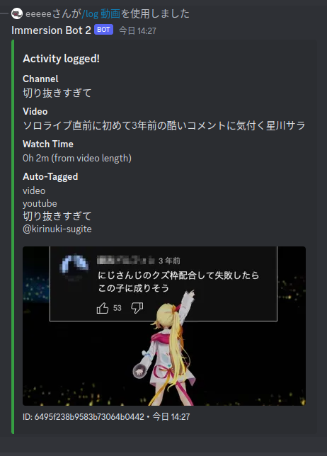
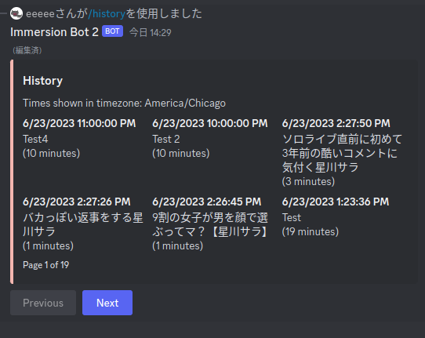
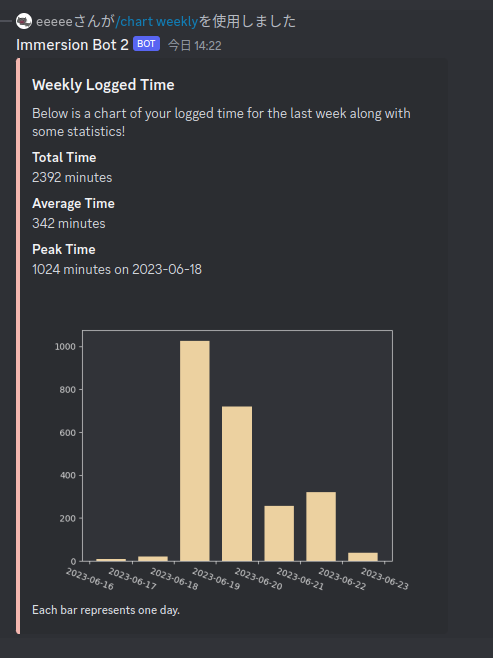
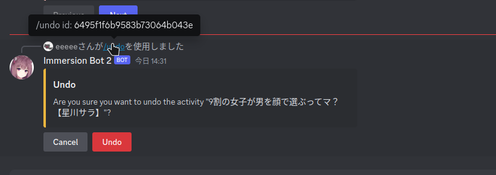

# Another Immersion Bot
This document describes how the bot is used and some of its features.

## Activity
Every log is an "Activity". Activities store the following information:

1. ID
2. Name
3. Duration
4. Date
5. Type
6. Tags

### ID

IDs are typically not needed to interact with the bot. One exception to this is to undo an activity that is not your latest activity.

### Name
This is the title of your activity, whether it be the name of an anime or a description of a conversation you had. This field is not optional.

### Duration 
This is how long the activity lasted for. Duration is only stored in **minutes**. There are some base conversions for logging episode and character counts, however, for the best approximation you should configure your own reading-speed and log episode lengths if not the standard 24 minute format.

### Date
This is mostly used for the date of the activity, however, if you wish for this data to also provide an accurate timeframe, it should be set to the **end** of the activity, and not the start. This is because the default date is the time of logging.

### Type
Every activity has a primary type. The two types are: **reading and listening**. Subtypes such as vn, anime, etc. will be be stores in the tags.

### Tags
These can be set manually (ex: `youtube,しぐれうい,配信`) when you use the *log manual* option. If you use a log subcommand then these will be filled out for you.

## Config
Users and guilds can configure some behavior. In some cases, these configurations will contradict each other. Currently, guilds can set a timezone, and users can set both their timezone and a reading-speed.

Timezones are determined as follows:
1. Manual Input (ex. `date: yesterday at 8pm JST`)
2. User config
3. Guild config
4. UTC

with the higher options taking priority.

## Command List
This is an overview of the top level command structure. It does not include subcommands.

1. Log
2. History
3. Chart
4. Export
5. Leaderboard
6. UserConfig
7. Config (for guild admins)
8. Undo

## Command Screenshots

This is a non exhaustive showcase of some important commands. 

### Log

### History

### Chart

### Undo

